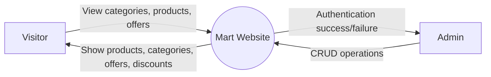
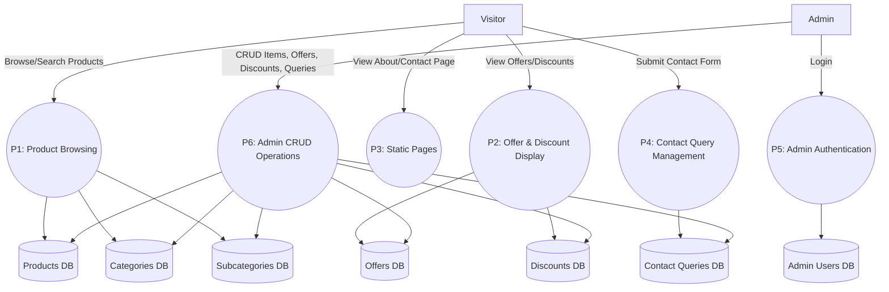
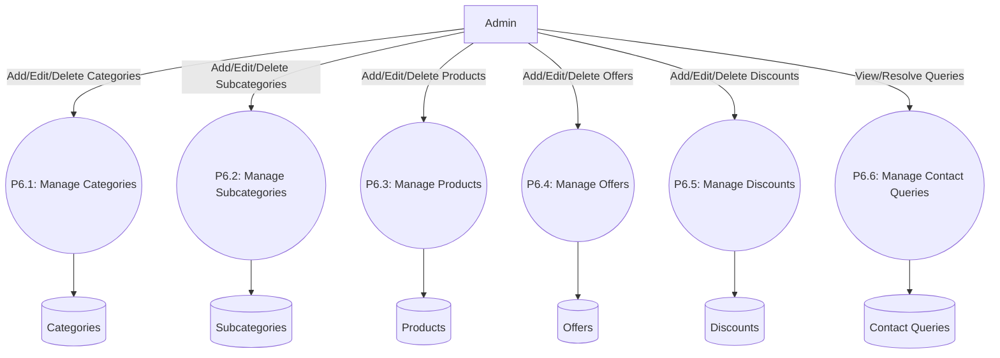

# Manali Mart – Product Catalog Website

A full-stack web application built for **Manali Mart**, a local store in Manali, Himachal Pradesh.  
The website allows customers to browse products category-wise, view pricing, see banners and discount offers, and contact the store via a contact form.  
An admin panel is included to manage products, categories, subcategories, banners, and discount banners.

---

## Features

### Customer-Facing Website
- Homepage with main banners and discount banners  
- Product listing organized by category and subcategory  
- Product details with pricing and optional discount information  
- Responsive design for desktop and mobile  
- Contact form to send inquiries directly to Manali Mart  

### Admin Panel
- CRUD (Create, Read, Update, Delete) operations for:
  - Products
  - Categories
  - Subcategories
  - Banners
  - Discount Banners
- Optional authentication for admin access to secure the dashboard

---

## Tech Stack
```
| Layer           | Technology |
|-----------------|------------|
| Frontend        | Next.js (React), TailwindCSS |
| Backend/API     | Next.js API Routes (Node.js) |
| Forms           | Next.js API Routes + Nodemailer or server-side storage |
| Deployment      | Vercel |
| Images          | Local `/public` folder or Cloudinary |
```
---

## Project Structure
```
manali-mart-website/
├── pages/ # Next.js pages
│ ├── index.js # Homepage
│ ├── products/[category].js
│ ├── contact.js
│ └── admin/ # Admin panel pages
├── components/ # Reusable UI components
├── lib/ # API helpers / server-side utilities
├── public/ # Images, banners
├── styles/ # Global CSS / Tailwind config
├── .env.local # Environment variables
├── .gitignore
├── package.json
├── LICENSE
└── README.md
```
---

## Project Data Flow

### Level 0 (Context Diagram)



### Level 1 DFD



### Level 2 DFD (Detailed)
- P1: Product Browsing
  ```mermaid
  flowchart TD
  Visitor[Visitor] -->|Choose Category| P1_1((P1.1: View Categories))
  Visitor -->|Search Items| P1_2((P1.2: Search Products))
  Visitor -->|Apply Filters| P1_3((P1.3: Apply Filters))
  Visitor -->|View Product Details| P1_4((P1.4: Product Description Page))

  P1_1 --> CategoryDB[(Categories)]
  P1_1 --> SubcategoryDB[(Subcategories)]
  P1_2 --> ProductDB[(Products)]
  P1_3 --> ProductDB
  P1_4 --> ProductDB
  P1_4 --> DiscountDB[(Discounts)]
```
- P6: Admin CRUD


---

## Installation & Setup

```bash
# Clone the repository
git clone https://github.com/your-username/manali-mart-website.git
cd manali-mart-website

# Install dependencies
npm install

# Setup environment variables
cp .env.example .env.local

# Run development server
npm run dev
```

Visit http://localhost:3000

---

## Deployment

- Recommended platform: Vercel
- Add environment variables in the Vercel dashboard
- Deploy directly from GitHub repository

---

## License

This project is shared publicly for educational and portfolio purposes only.  
Copying, redistributing, or using this code for commercial purposes is not allowed without permission.

See the [LICENSE](LICENSE) file for details.

---

## Authors

- Kartik Dhiman: kartikdhiman0711@gmail.com
- Anirudh Sharma: anirudhsharma150520@gmail.com
